# FullScreenMonitor 状態遷移図

## 1. アプリケーション全体の状態遷移

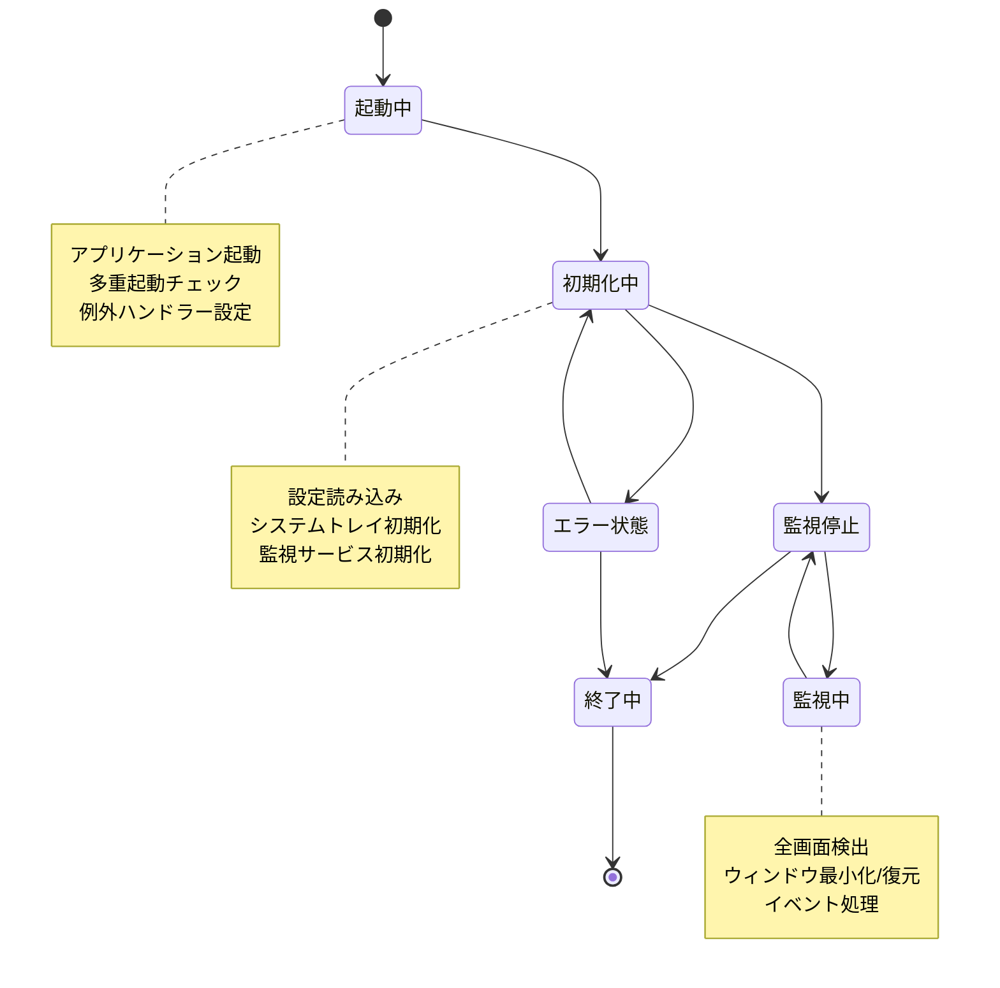
```mermaid
stateDiagram-v2
    [*] --> 起動中
    起動中 --> 初期化中
    初期化中 --> 監視停止
    監視停止 --> 監視中
    監視中 --> 監視停止
    監視停止 --> 終了中
    終了中 --> [*]

    初期化中 --> エラー状態
    エラー状態 --> 初期化中
    エラー状態 --> 終了中

    note right of 起動中
        アプリケーション起動
        多重起動チェック
        例外ハンドラー設定
    end note

    note right of 初期化中
        設定読み込み
        システムトレイ初期化
        監視サービス初期化
    end note

    note right of 監視中
        全画面検出
        ウィンドウ最小化/復元
        イベント処理
    end note
```

## 2. 監視サービスの状態遷移

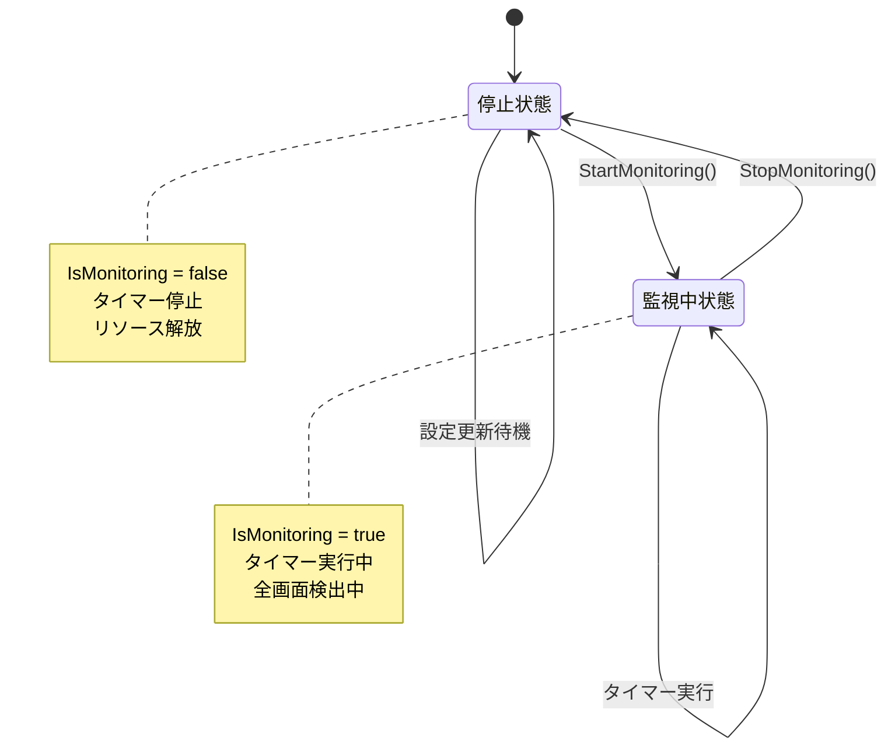
```mermaid
stateDiagram-v2
    [*] --> 停止状態
    停止状態 --> 監視中状態 : StartMonitoring()
    監視中状態 --> 停止状態 : StopMonitoring()
    監視中状態 --> 監視中状態 : UpdateSettings()

    停止状態 --> 停止状態 : 設定更新待機
    監視中状態 --> 監視中状態 : タイマー実行

    note right of 停止状態
        IsMonitoring = false
        タイマー停止
        リソース解放
    end note

    note right of 監視中状態
        IsMonitoring = true
        タイマー実行中
        全画面検出中
    end note
```

## 3. 全画面検出の状態遷移

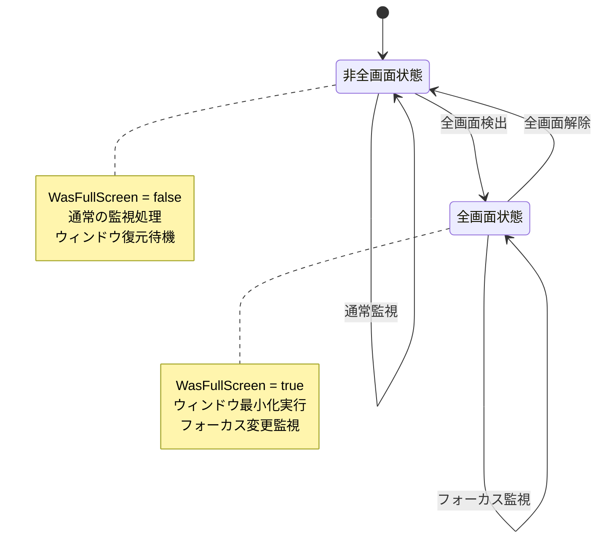
```mermaid
stateDiagram-v2
    [*] --> 非全画面状態
    非全画面状態 --> 全画面状態 : 全画面検出
    全画面状態 --> 非全画面状態 : 全画面解除
    全画面状態 --> 全画面状態 : フォーカス変更

    非全画面状態 --> 非全画面状態 : 通常監視
    全画面状態 --> 全画面状態 : フォーカス監視

    note right of 非全画面状態
        WasFullScreen = false
        通常の監視処理
        ウィンドウ復元待機
    end note

    note right of 全画面状態
        WasFullScreen = true
        ウィンドウ最小化実行
        フォーカス変更監視
    end note
```

## 4. ウィンドウ管理の状態遷移

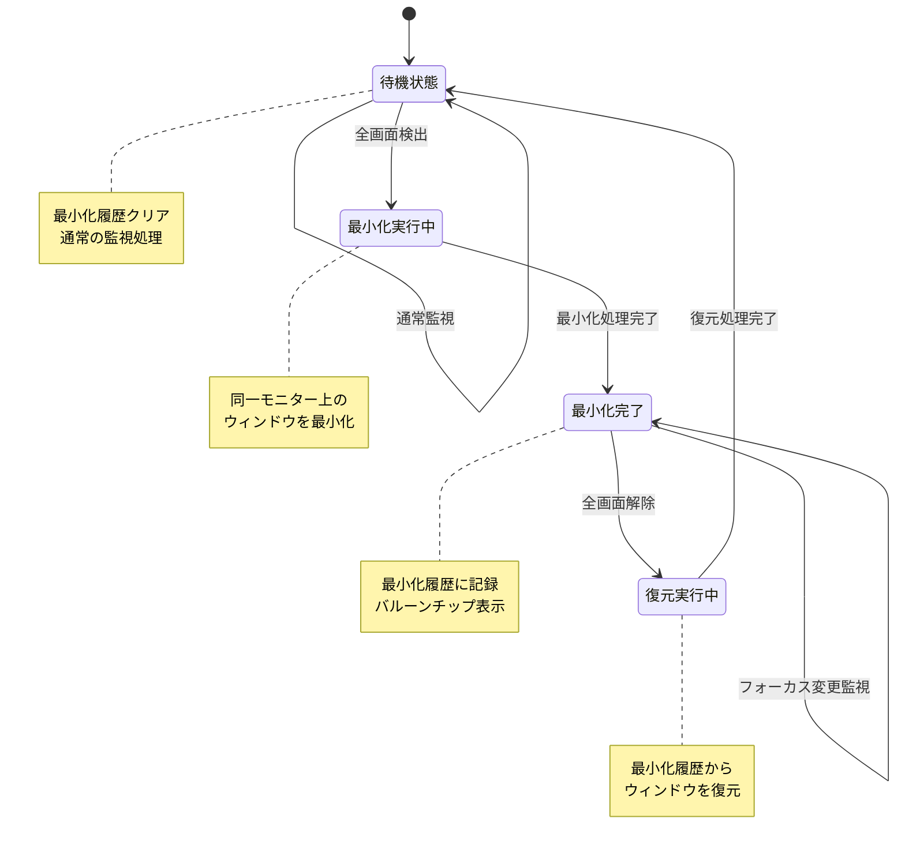
```mermaid
stateDiagram-v2
    [*] --> 待機状態
    待機状態 --> 最小化実行中 : 全画面検出
    最小化実行中 --> 最小化完了 : 最小化処理完了
    最小化完了 --> 復元実行中 : 全画面解除
    復元実行中 --> 待機状態 : 復元処理完了

    待機状態 --> 待機状態 : 通常監視
    最小化完了 --> 最小化完了 : フォーカス変更監視

    note right of 待機状態
        最小化履歴クリア
        通常の監視処理
    end note

    note right of 最小化実行中
        同一モニター上の
        ウィンドウを最小化
    end note

    note right of 最小化完了
        最小化履歴に記録
        バルーンチップ表示
    end note

    note right of 復元実行中
        最小化履歴から
        ウィンドウを復元
    end note
```

## 5. 設定管理の状態遷移

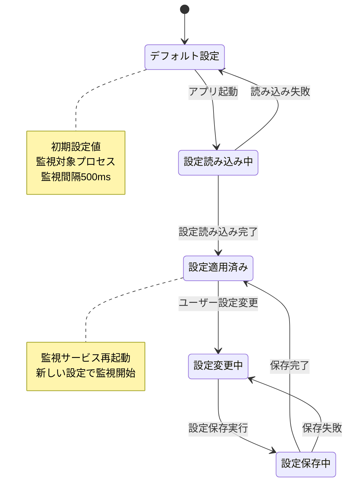
```mermaid
stateDiagram-v2
    [*] --> デフォルト設定
    デフォルト設定 --> 設定読み込み中 : アプリ起動
    設定読み込み中 --> 設定適用済み : 設定読み込み完了
    設定適用済み --> 設定変更中 : ユーザー設定変更
    設定変更中 --> 設定保存中 : 設定保存実行
    設定保存中 --> 設定適用済み : 保存完了

    設定読み込み中 --> デフォルト設定 : 読み込み失敗
    設定保存中 --> 設定変更中 : 保存失敗

    note right of デフォルト設定
        初期設定値
        監視対象プロセス
        監視間隔500ms
    end note

    note right of 設定適用済み
        監視サービス再起動
        新しい設定で監視開始
    end note
```

## 6. UI状態の遷移

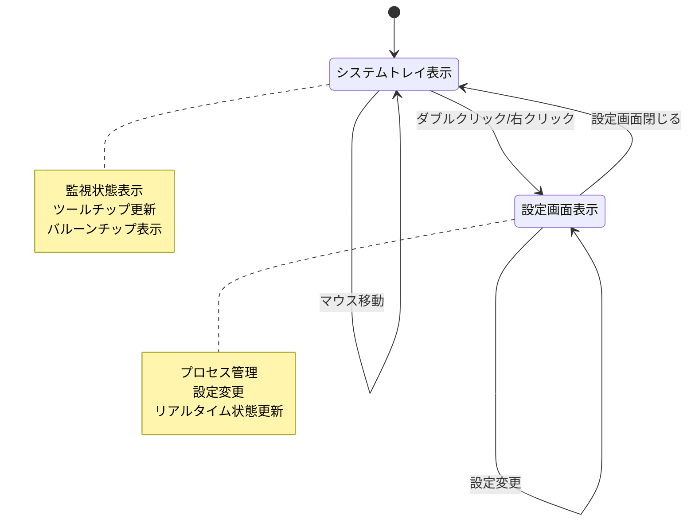
```mermaid
stateDiagram-v2
    [*] --> システムトレイ表示
    システムトレイ表示 --> 設定画面表示 : ダブルクリック/右クリック
    設定画面表示 --> システムトレイ表示 : 設定画面閉じる

    システムトレイ表示 --> システムトレイ表示 : マウス移動
    設定画面表示 --> 設定画面表示 : 設定変更

    note right of システムトレイ表示
        監視状態表示
        ツールチップ更新
        バルーンチップ表示
    end note

    note right of 設定画面表示
        プロセス管理
        設定変更
        リアルタイム状態更新
    end note
```

## 7. イベント駆動の状態遷移

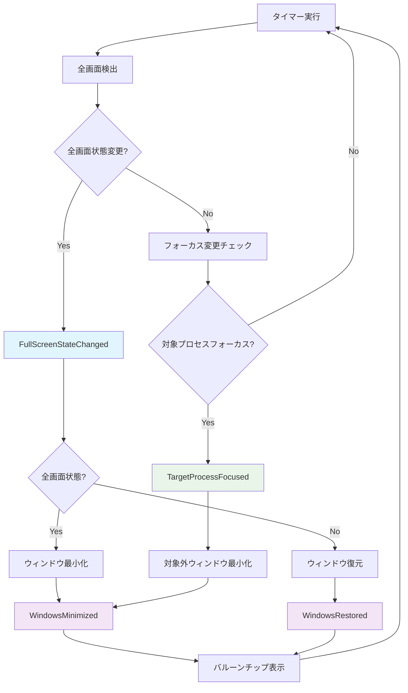
```mermaid
flowchart TD
    A[タイマー実行] --> B[全画面検出]
    B --> C{全画面状態変更?}
    C -->|Yes| D[FullScreenStateChanged]
    C -->|No| E[フォーカス変更チェック]

    D --> F{全画面状態?}
    F -->|Yes| G[ウィンドウ最小化]
    F -->|No| H[ウィンドウ復元]

    G --> I[WindowsMinimized]
    H --> J[WindowsRestored]

    I --> K[バルーンチップ表示]
    J --> K

    E --> L{対象プロセスフォーカス?}
    L -->|Yes| M[TargetProcessFocused]
    L -->|No| A

    M --> N[対象外ウィンドウ最小化]
    N --> I

    K --> A

    style D fill:#e1f5fe
    style I fill:#f3e5f5
    style J fill:#f3e5f5
    style M fill:#e8f5e8
```

## 8. エラーハンドリングの状態遷移

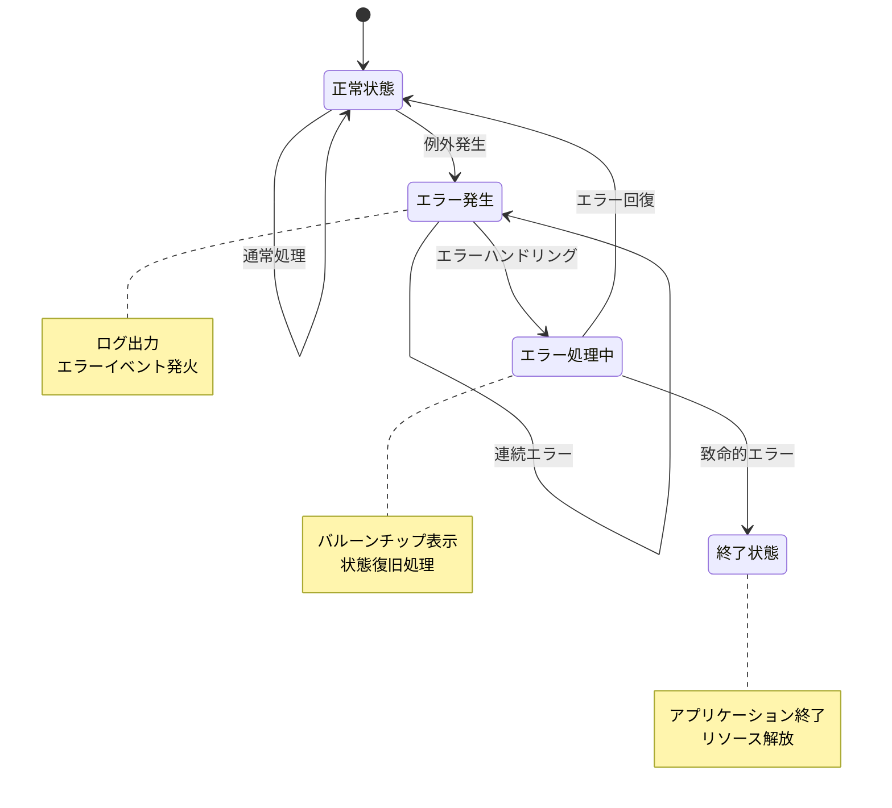
```mermaid
stateDiagram-v2
    [*] --> 正常状態
    正常状態 --> エラー発生 : 例外発生
    エラー発生 --> エラー処理中 : エラーハンドリング
    エラー処理中 --> 正常状態 : エラー回復
    エラー処理中 --> 終了状態 : 致命的エラー

    正常状態 --> 正常状態 : 通常処理
    エラー発生 --> エラー発生 : 連続エラー

    note right of エラー発生
        ログ出力
        エラーイベント発火
    end note

    note right of エラー処理中
        バルーンチップ表示
        状態復旧処理
    end note

    note right of 終了状態
        アプリケーション終了
        リソース解放
    end note
```

## 9. アプリケーションライフサイクル全体

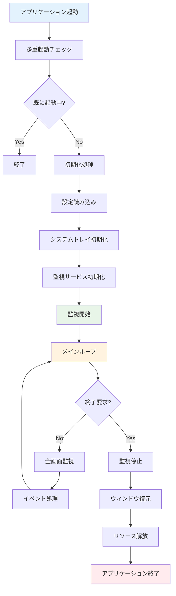
```mermaid
flowchart TD
    A[アプリケーション起動] --> B[多重起動チェック]
    B --> C{既に起動中?}
    C -->|Yes| D[終了]
    C -->|No| E[初期化処理]

    E --> F[設定読み込み]
    F --> G[システムトレイ初期化]
    G --> H[監視サービス初期化]
    H --> I[監視開始]

    I --> J[メインループ]
    J --> K{終了要求?}
    K -->|No| L[全画面監視]
    L --> M[イベント処理]
    M --> J

    K -->|Yes| N[監視停止]
    N --> O[ウィンドウ復元]
    O --> P[リソース解放]
    P --> Q[アプリケーション終了]

    style A fill:#e3f2fd
    style I fill:#e8f5e8
    style J fill:#fff3e0
    style Q fill:#ffebee
```

## 10. サービスコンテナの状態遷移

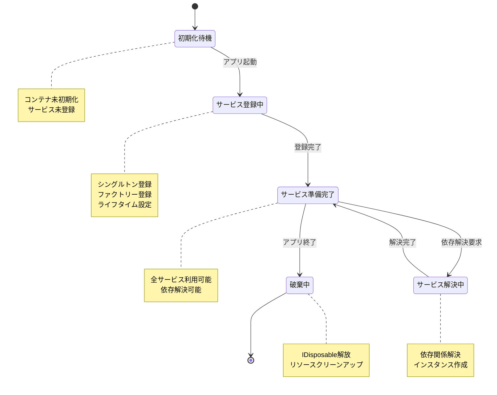
```mermaid
stateDiagram-v2
    [*] --> 初期化待機
    初期化待機 --> サービス登録中 : アプリ起動
    サービス登録中 --> サービス準備完了 : 登録完了
    サービス準備完了 --> サービス解決中 : 依存解決要求
    サービス解決中 --> サービス準備完了 : 解決完了
    サービス準備完了 --> 破棄中 : アプリ終了
    破棄中 --> [*]

    note right of 初期化待機
        コンテナ未初期化
        サービス未登録
    end note

    note right of サービス登録中
        シングルトン登録
        ファクトリー登録
        ライフタイム設定
    end note

    note right of サービス準備完了
        全サービス利用可能
        依存解決可能
    end note

    note right of サービス解決中
        依存関係解決
        インスタンス作成
    end note

    note right of 破棄中
        IDisposable解放
        リソースクリーンアップ
    end note
```

## 11. ViewModelの状態遷移

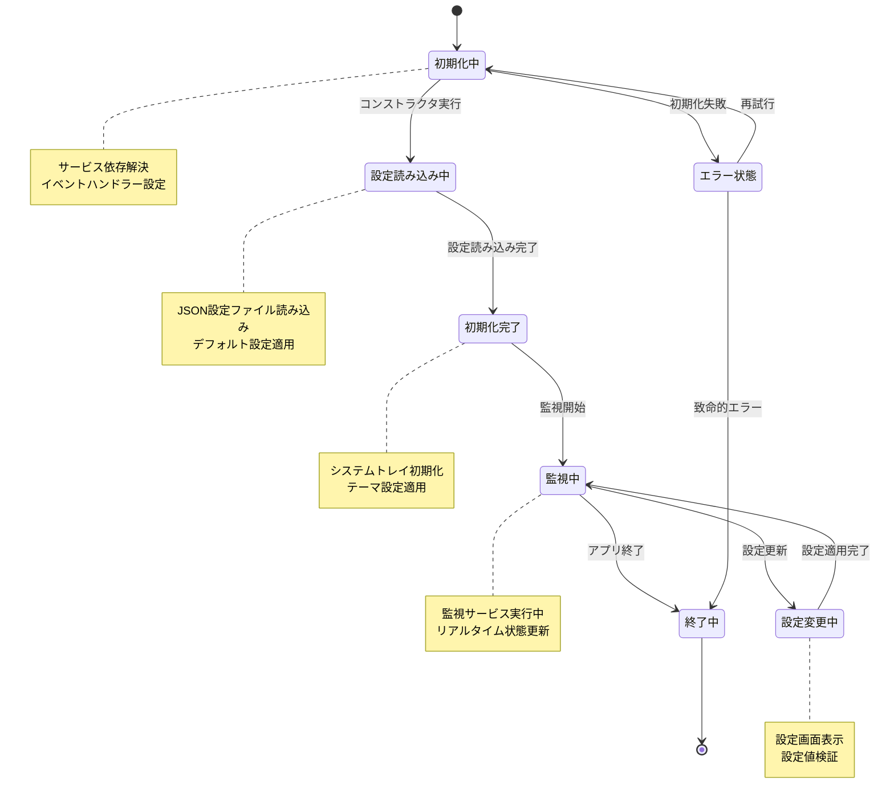
```mermaid
stateDiagram-v2
    [*] --> 初期化中
    初期化中 --> 設定読み込み中 : コンストラクタ実行
    設定読み込み中 --> 初期化完了 : 設定読み込み完了
    初期化完了 --> 監視中 : 監視開始
    監視中 --> 設定変更中 : 設定更新
    設定変更中 --> 監視中 : 設定適用完了
    監視中 --> 終了中 : アプリ終了
    終了中 --> [*]

    初期化中 --> エラー状態 : 初期化失敗
    エラー状態 --> 初期化中 : 再試行
    エラー状態 --> 終了中 : 致命的エラー

    note right of 初期化中
        サービス依存解決
        イベントハンドラー設定
    end note

    note right of 設定読み込み中
        JSON設定ファイル読み込み
        デフォルト設定適用
    end note

    note right of 初期化完了
        システムトレイ初期化
        テーマ設定適用
    end note

    note right of 監視中
        監視サービス実行中
        リアルタイム状態更新
    end note

    note right of 設定変更中
        設定画面表示
        設定値検証
    end note
```

## 12. 手動復元機能の状態遷移

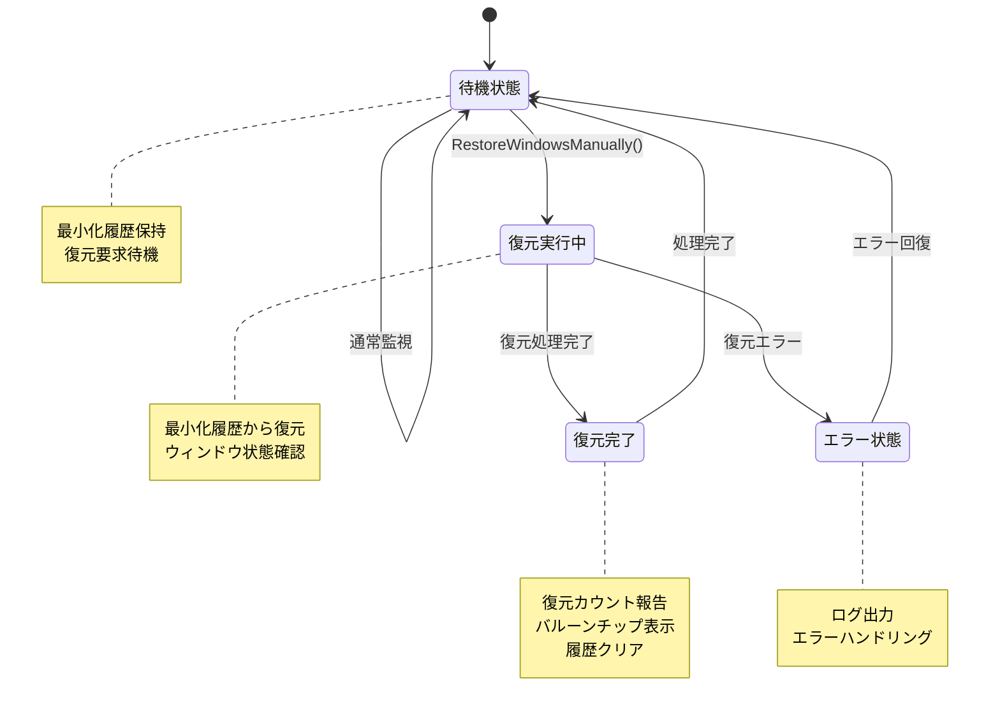
```mermaid
stateDiagram-v2
    [*] --> 待機状態
    待機状態 --> 復元実行中 : RestoreWindowsManually()
    復元実行中 --> 復元完了 : 復元処理完了
    復元完了 --> 待機状態 : 処理完了

    待機状態 --> 待機状態 : 通常監視
    復元実行中 --> エラー状態 : 復元エラー
    エラー状態 --> 待機状態 : エラー回復

    note right of 待機状態
        最小化履歴保持
        復元要求待機
    end note

    note right of 復元実行中
        最小化履歴から復元
        ウィンドウ状態確認
    end note

    note right of 復元完了
        復元カウント報告
        バルーンチップ表示
        履歴クリア
    end note

    note right of エラー状態
        ログ出力
        エラーハンドリング
    end note
```

## 13. テーマ管理の状態遷移

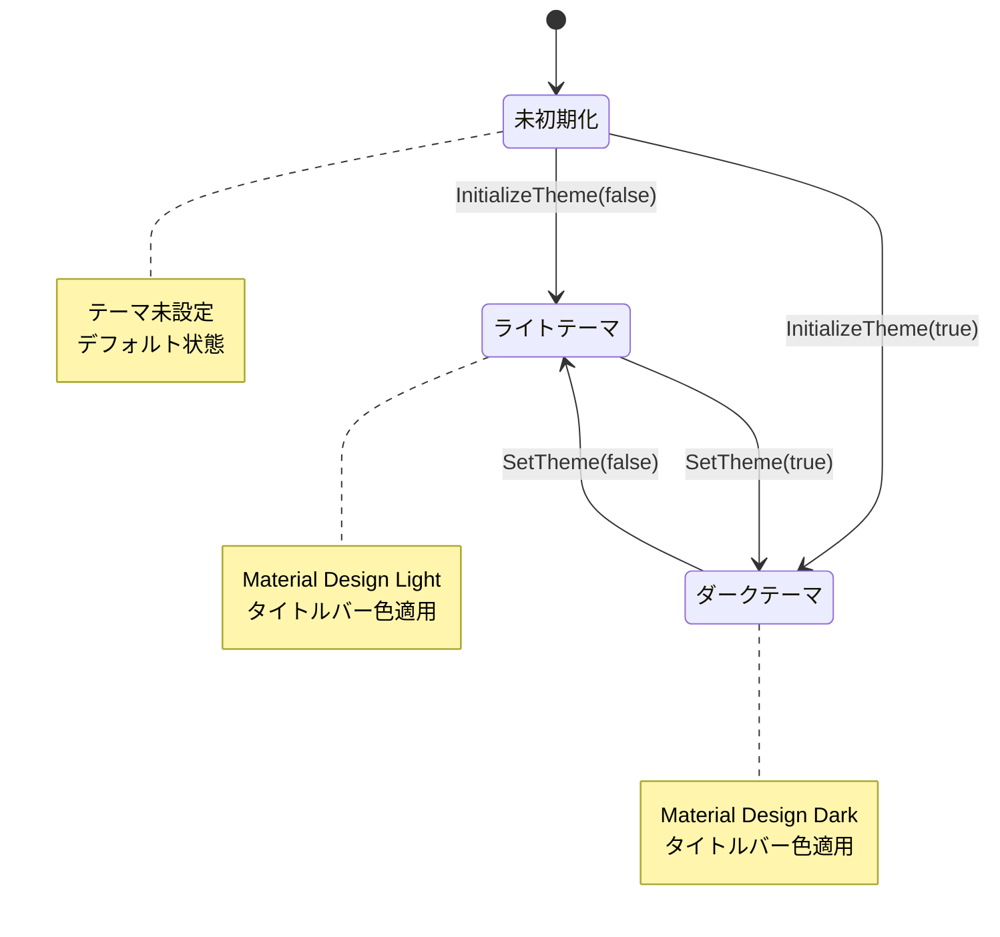
```mermaid
stateDiagram-v2
    [*] --> 未初期化
    未初期化 --> ライトテーマ : InitializeTheme(false)
    未初期化 --> ダークテーマ : InitializeTheme(true)
    ライトテーマ --> ダークテーマ : SetTheme(true)
    ダークテーマ --> ライトテーマ : SetTheme(false)

    note right of 未初期化
        テーマ未設定
        デフォルト状態
    end note

    note right of ライトテーマ
        Material Design Light
        タイトルバー色適用
    end note

    note right of ダークテーマ
        Material Design Dark
        タイトルバー色適用
    end note
```

## 14. プロセス管理の状態遷移

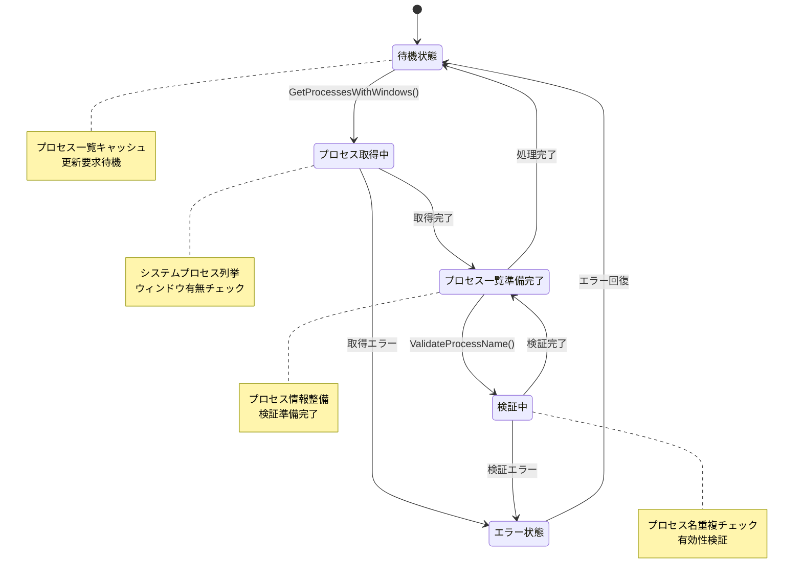
```mermaid
stateDiagram-v2
    [*] --> 待機状態
    待機状態 --> プロセス取得中 : GetProcessesWithWindows()
    プロセス取得中 --> プロセス一覧準備完了 : 取得完了
    プロセス一覧準備完了 --> 検証中 : ValidateProcessName()
    検証中 --> プロセス一覧準備完了 : 検証完了
    プロセス一覧準備完了 --> 待機状態 : 処理完了

    プロセス取得中 --> エラー状態 : 取得エラー
    検証中 --> エラー状態 : 検証エラー
    エラー状態 --> 待機状態 : エラー回復

    note right of 待機状態
        プロセス一覧キャッシュ
        更新要求待機
    end note

    note right of プロセス取得中
        システムプロセス列挙
        ウィンドウ有無チェック
    end note

    note right of プロセス一覧準備完了
        プロセス情報整備
        検証準備完了
    end note

    note right of 検証中
        プロセス名重複チェック
        有効性検証
    end note
```

## 15. 状態遷移の特徴

### 設計パターン
- **イベント駆動アーキテクチャ**: 状態変更はイベントを通じて通知
- **責任分離**: 各クラスが特定の状態管理を担当
- **依存性注入**: ServiceContainerによる疎結合設計
- **MVVMパターン**: ViewModelによる状態管理とビジネスロジック分離
- **永続化**: 重要な状態は設定ファイルに保存
- **リアルタイム更新**: UI状態は定期的に更新
- **エラー耐性**: 例外発生時も状態の整合性を維持

### 状態管理のポイント
1. **ロック機構**: 並行アクセス制御
2. **例外処理**: 状態の整合性維持
3. **リソース管理**: メモリリーク防止
4. **イベント連鎖**: 状態変更の伝播
5. **永続化**: 設定の保存と復元
6. **依存性管理**: DIコンテナによるライフサイクル管理
7. **手動復元**: ユーザー主導のウィンドウ復元機能
